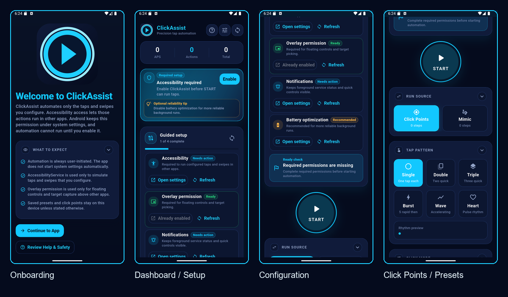

# ClickAssist

<p align="center">
  
</p>

**User-controlled tap and swipe automation for Android.**

Current version: 1.0.1

ClickAssist is an open-source Flutter + Kotlin app for building repeatable tap and swipe routines on Android. It is designed around transparency, manual setup, visible controls, and local-only configuration so users understand exactly what is being automated.

> ClickAssist is a user-controlled automation tool. Use it only in apps, games, and workflows where automation is allowed.

## Screenshots



The current preview shows the onboarding, setup guide, configuration, and click-points/presets screens from the 1.0.1 build. Individual screenshots are available in [docs/screenshots](docs/screenshots/README.md).

## What It Does

ClickAssist helps users automate repetitive on-screen interactions they configure themselves:

- Pick real on-screen tap targets.
- Record mimic patterns with taps and swipes.
- Choose sequential or simultaneous execution.
- Control speed, start delay, count mode, and visual gesture feedback.
- Use a floating overlay to start and stop automation from other apps.
- Save and load presets for different workflows.

## Features

- Manual click points with editable targets.
- Mimic pattern recorder for taps and swipes.
- Swipe direction support and gesture indicators.
- Sequential and simultaneous multi-point modes.
- Speed presets from slow to ultra-fast, plus custom intervals.
- Start delay presets and custom delay.
- Presets with custom names, import/export, edit, delete, and quick load.
- Floating overlay controls for use outside the app.
- Overlay safe-zone protection so generated taps avoid the floating controls.
- Improved target picker flow for selecting real on-screen positions.
- Setup health checks for accessibility, overlay, notifications, battery optimization, battery level, device temperature, and run intensity.
- Help & Safety, privacy summary, responsible-use text, and permission disclosures.

## Installation

### Requirements

- Flutter SDK
- Android Studio or Android SDK command-line tools
- Android device or emulator
- Android accessibility service support

### Run Locally

```bash
git clone https://github.com/ratkotech/clickassist.git
cd clickassist/implementation/clickassist
flutter pub get
flutter run
```

### Build Android Debug APK

```bash
cd implementation/clickassist
flutter build apk --debug
```

For a Gradle-only build on Windows:

```powershell
cd implementation\clickassist\android
.\gradlew.bat assembleDebug
```

### Download APK

A prebuilt APK for personal testing is available at:

```text
release-artifacts/clickassist-release.apk
```

This APK is provided for convenience. Android may warn before installing apps from outside the Play Store, and users should only install APKs from sources they trust.

## Usage

1. Open ClickAssist.
2. Complete the onboarding and review Help & Safety.
3. Enable only the permissions needed for the feature you want to use.
4. Choose a run source: Click Points or Mimic Pattern.
5. Add targets manually or record a mimic pattern.
6. Configure speed, delay, run mode, and visual feedback.
7. Press Start in the app or use the floating overlay from another app.
8. Stop automation from the app, overlay, or notification controls.

## Permissions

ClickAssist asks for sensitive Android permissions only for user-triggered features.

| Permission / Access | Why It Is Used | Required? |
| --- | --- | --- |
| AccessibilityService | Dispatches the taps and swipes configured by the user. | Required for automation |
| Display over other apps | Shows floating controls and target picker overlays. | Required for overlay features |
| Notifications | Shows foreground status and native quick controls. | Recommended for background controls |
| Battery optimization exemption | Helps Android avoid interrupting long background runs. | Optional |
| Foreground service | Keeps overlay controls visible with a notification while active. | Required when overlay service runs |

ClickAssist does not enable these automatically. Android system screens are opened only after the user chooses to continue.

## Privacy

Based on the current open-source codebase, ClickAssist stores presets, click points, pattern steps, onboarding state, and preferences locally on the device. No analytics SDK, crash reporting SDK, cloud sync, or account system is included.

Read the full [Privacy Policy](privacy-policy.md) and [Responsible Use](responsible-use.md).

## Tech Stack

- Flutter / Dart for the app UI and state layer.
- Riverpod for state management.
- Hive for local presets, onboarding state, and app preferences.
- Kotlin for Android gesture execution, accessibility service, overlay service, and platform bridge.
- Flutter MethodChannel and EventChannel for native integration.

## Documentation

- [Project Analysis](docs/analysis/README.md)
- [Changelog](CHANGELOG.md)
- [Screenshots](docs/screenshots/README.md)
- [Play Store Review Checklist](docs/play-store-review-checklist.md)
- [Outdated Documentation Archive](docs/outdated/README.md)

## Project Structure

```text
clickassist/
├── design/
├── docs/
└── implementation/
    └── clickassist/
        ├── android/
        ├── assets/
        │   └── branding/
        ├── lib/
        ├── test/
        └── pubspec.yaml
```

## License

This project is licensed under the terms in [LICENSE](LICENSE).
