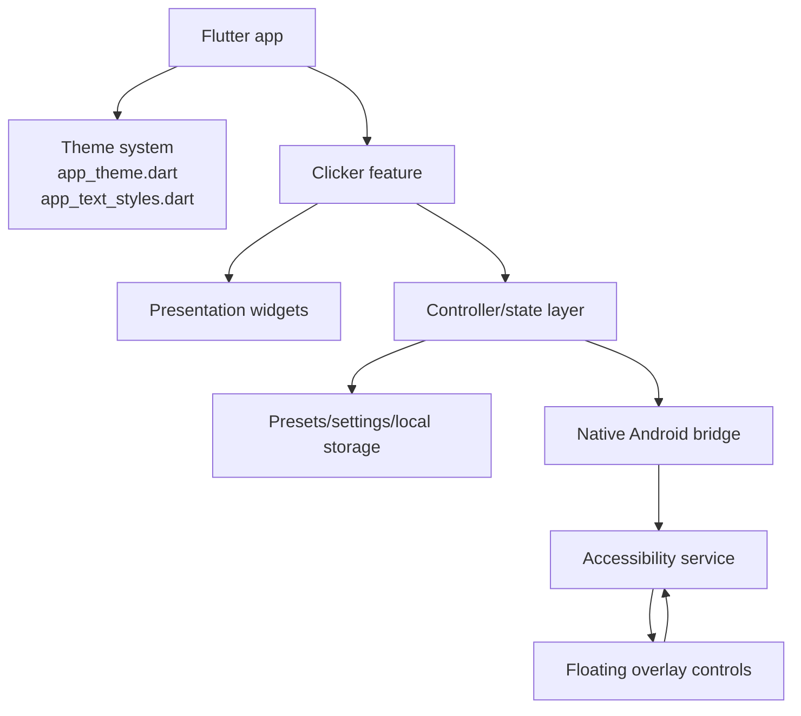

# 03. Architecture

ClickAssist is a Flutter app with a native Android layer for accessibility and overlay behavior.

## Repository structure

```text
clickassist/
  README.md
  design/
    clickassist-app-icon.svg
    clickassist-app-icon.png
  docs/
    analysis/
    screenshots/
    outdated/
  implementation/
    clickassist/
      lib/
      assets/
        branding/
          clickassist-app-icon.png
          clickassist-adaptive-foreground.png
      android/
      test/
```

## Flutter app structure

Important Flutter areas include:

- `implementation/clickassist/lib/app/theme/` — centralized colors, spacing, text styles, and `ThemeData`
- `implementation/clickassist/lib/widgets/brand_logo.dart` — reusable brand logo widget
- `implementation/clickassist/lib/features/clicker/` — clicker UI, state, setup, presets, settings, and related presentation widgets
- `implementation/clickassist/test/` — widget, theme, branding, and consistency tests

The app uses a feature-oriented structure for the clicker domain, with reusable app-level theme and branding components shared across screens.

## Native Android structure

Important native Android files include:

- `AutoClickAccessibilityService.kt` — accessibility service that dispatches gestures
- `ClickAssistBridge.kt` — bridge between Flutter and native Android behavior
- `FloatingOverlayService.kt` — floating overlay controls shown above other apps
- `PointPickerOverlayService.kt` — point picker overlay behavior
- `GestureIndicatorOverlay.kt` — visual gesture/click feedback
- `OverlayProtection.kt` — pure Kotlin overlay hit-zone protection logic
- `MainActivity.kt` — Flutter activity and Android integration entry point
- `AppStatusNotifier.kt` — native status notification behavior

## Theme system

The theme system is centralized in:

- `implementation/clickassist/lib/app/theme/app_theme.dart`
- `implementation/clickassist/lib/app/theme/app_text_styles.dart`
- `implementation/clickassist/lib/app/theme/app_colors.dart`
- `implementation/clickassist/lib/app/theme/app_spacing.dart`

`app_theme.dart` wires the centralized typography into Flutter `ThemeData`, including text theme, app bar, dialogs, inputs, buttons, cards, chips, and related component defaults.

## Storage, settings, and presets

The app stores user-facing clicker preferences and presets locally. Presets/settings are part of the clicker feature and are used to restore common automation configurations.

## High-level architecture


