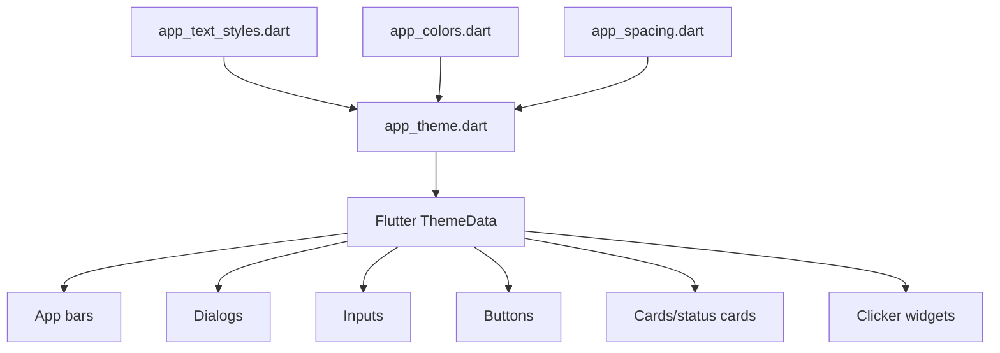

# 05. Theme and Typography

ClickAssist uses a centralized theme and typography system to keep the UI consistent.

## Centralized typography

Typography is centralized in:

```text
implementation/clickassist/lib/app/theme/app_text_styles.dart
```

This file defines reusable text styles instead of requiring every widget to create its own one-off typography values.

## App-wide theme configuration

App-wide theme configuration is handled in:

```text
implementation/clickassist/lib/app/theme/app_theme.dart
```

The theme wires centralized tokens into Flutter `ThemeData`, including:

- `TextTheme`
- app bar theme
- dialogs
- input decoration
- elevated/outlined/text buttons
- cards and other shared component defaults

Supporting theme files include:

- `app_colors.dart`
- `app_spacing.dart`

## Updated widgets

Recent styling work included these widgets:

- `clicker_start_button.dart`
- `dashboard_status_card.dart`
- `setup_guide_card.dart`
- Settings/About information in `settings_legal_page.dart`

The goal was to reduce hardcoded widget-level typography overrides and let app-wide theme defaults carry more of the visual system.

## Maintainability benefit

Centralized theme and typography make the app easier to maintain because:

- visual changes can be made in one place
- widget tests can guard theme usage
- new screens can inherit consistent defaults
- UI polish does not require repeated manual changes across many widgets

## Guard tests

The repository includes a typography consistency guard test:

```text
implementation/clickassist/test/widgets/typography_consistency_test.dart
```

Theme-related tests also exist under:

```text
implementation/clickassist/test/app/theme/
```

## Theme dependency diagram


