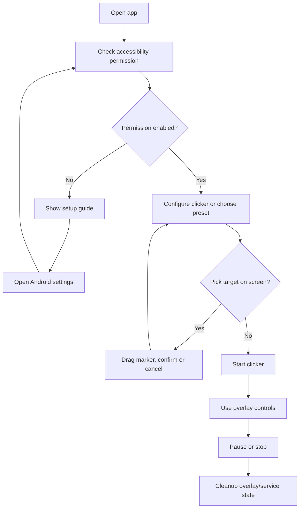
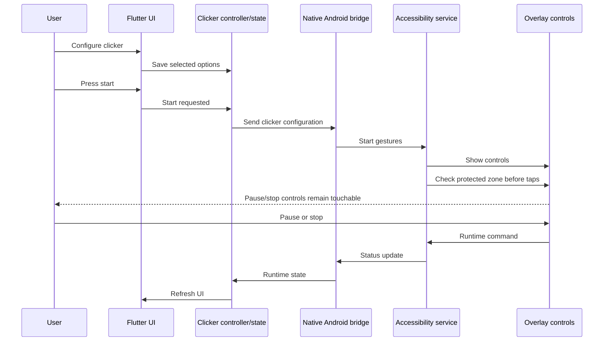

# 07. Clicker Flow Analysis

This document describes the current end-to-end clicker flow.

The current documented flow reflects version `1.0.1`, including overlay safe-zone checks and the improved pick-on-screen target picker.

## Runtime flow

1. User opens ClickAssist.
2. App checks setup/permission state.
3. If accessibility permission is missing, the setup guide directs the user to Android settings.
4. User configures click points, clicker mode, speed, and related options, or selects a preset.
5. If the user chooses Pick On Screen, Flutter opens `PointPickerOverlayService.kt`.
6. The native picker lets the user drag the marker, review live coordinates, and confirm or cancel.
7. User starts the clicker.
8. Flutter sends the command/configuration to the native Android layer.
9. `AutoClickAccessibilityService.kt` runs the click loop through accessibility gestures.
10. `FloatingOverlayService.kt` shows runtime controls above other apps.
11. Before each generated tap, the native layer checks whether the target would intersect the overlay protected zone.
12. User pauses, resumes, or stops the clicker from the overlay.
13. Native services clean up overlay/runtime state.

## User flow

## Sequence diagram

## Cleanup expectations

The native Android side should remove overlay UI and stop pending click work when the clicker is stopped. If the service is unavailable or permission is missing, the app should guide the user back to setup rather than pretending the clicker can run.
