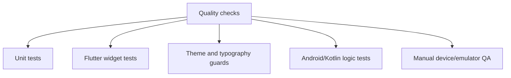

# 09. Testing and Quality

ClickAssist includes Flutter tests and native Android/Kotlin tests. The current test suite is especially useful for guarding theme consistency, branding assets, widgets, and overlay protection logic.

## Current test areas

### Flutter tests

Current Flutter tests include:

- theme tests under `implementation/clickassist/test/app/theme/`
- typography consistency guard in `implementation/clickassist/test/widgets/typography_consistency_test.dart`
- dashboard status card tests
- setup guide card tests
- brand/logo tests
- settings/legal spacing tests
- point picker UX tests for native picker structure, active-picker copy, and confirmed target-card readability

These tests help prevent visual regressions in the app-wide typography, theme, and key widgets.

### Native Android/Kotlin tests

The repository includes:

```text
implementation/clickassist/android/app/src/test/kotlin/app/clickassist/android/OverlayProtectionTest.kt
```

This tests the pure Kotlin overlay protection logic, including protected-zone detection and relocation behavior.

## Quality guards currently present

- Typography consistency guard test.
- App theme tests.
- Widget tests for key UI components.
- Branding asset consistency tests.
- Overlay safe-zone logic tests.
- Point picker UX guard tests.

## Recommended future tests

- Permission flow tests around missing/enabled accessibility permission.
- Preset save/load tests.
- Start/stop/pause state tests.
- Native/instrumented tests for picker overlay drag/confirm/cancel behavior if Android test infrastructure is expanded.
- More Android tests around overlay lifecycle cleanup.
- Real-device or emulator manual QA for overlay placement, dragging, and protected tap skipping.
- Screenshot regression workflow after the UI stabilizes.

## Testing strategy


