# ClickAssist Diagrams

This file contains current Mermaid diagrams for the ClickAssist architecture, user flows, overlay lifecycle, safe-zone behavior, theme system, presets, and testing strategy.

## A. High-level app architecture

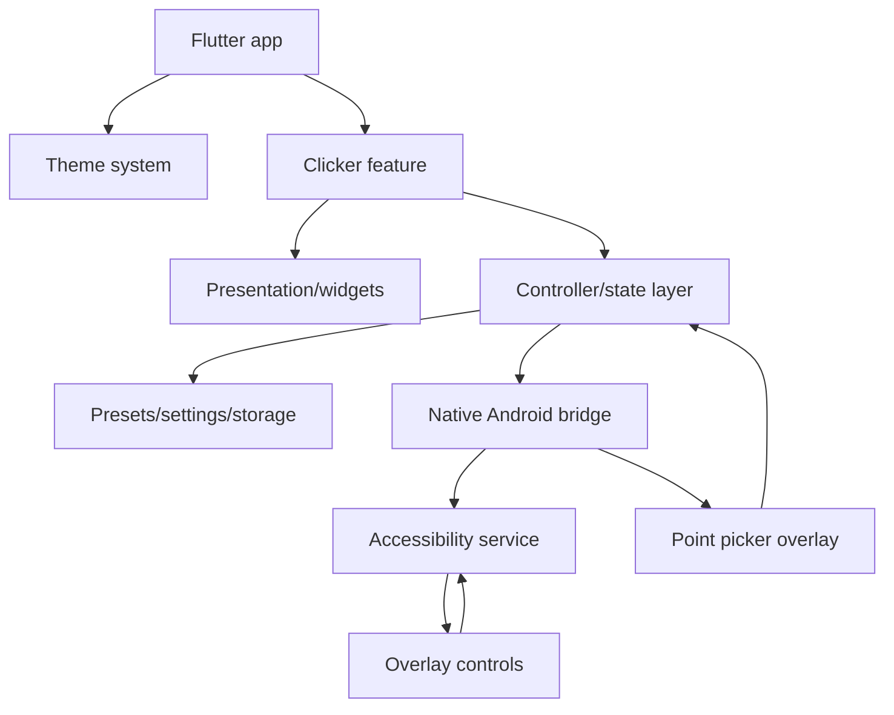

## B. Folder/module structure

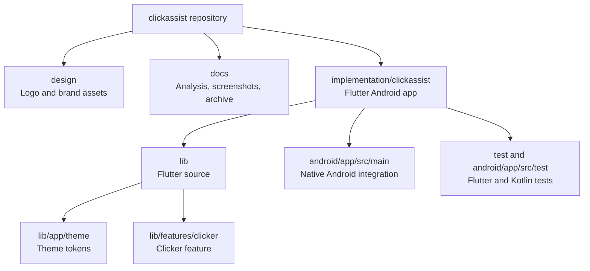

## C. User journey flow

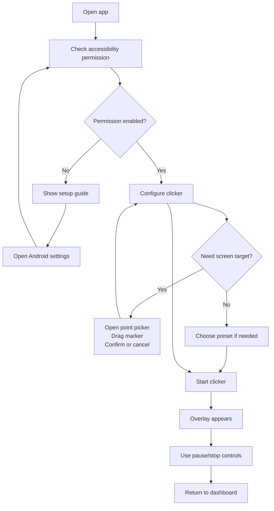

## D. Accessibility permission flow

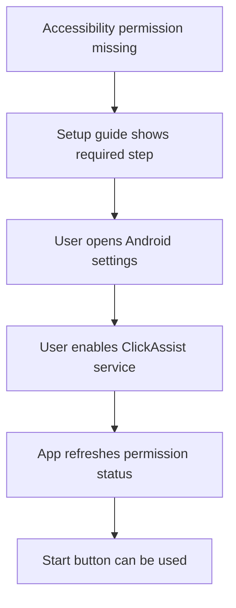

## E. Clicker start sequence

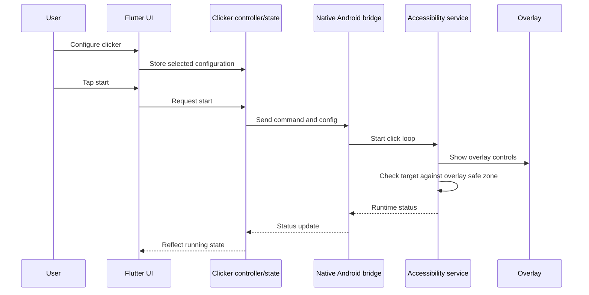

## F. Point picker target-selection flow

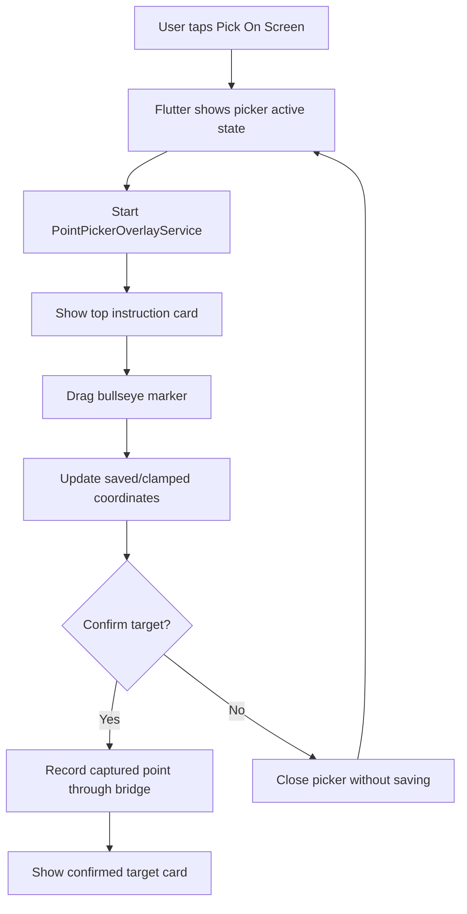

## G. Overlay lifecycle

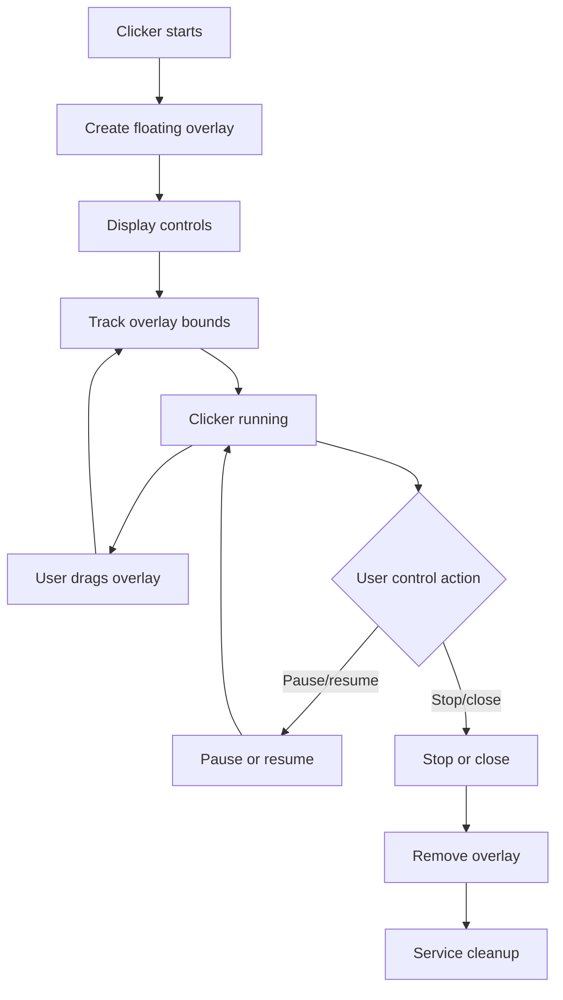

## H. Overlay safe-zone protection

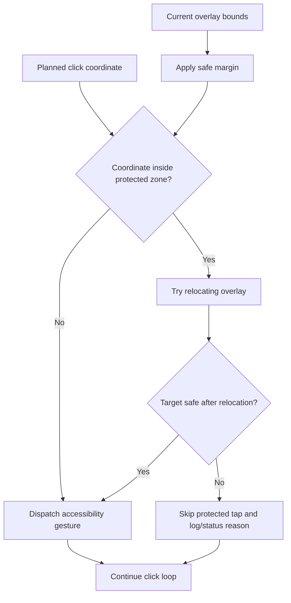

## I. Theme and typography dependency

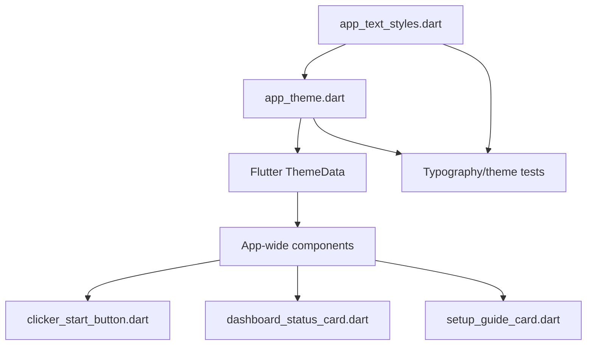

## J. Preset/configuration flow

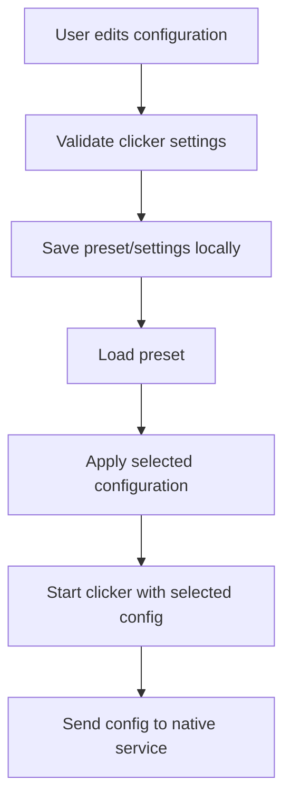

## K. Testing strategy

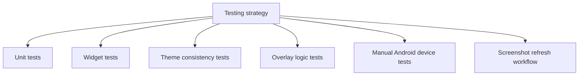
