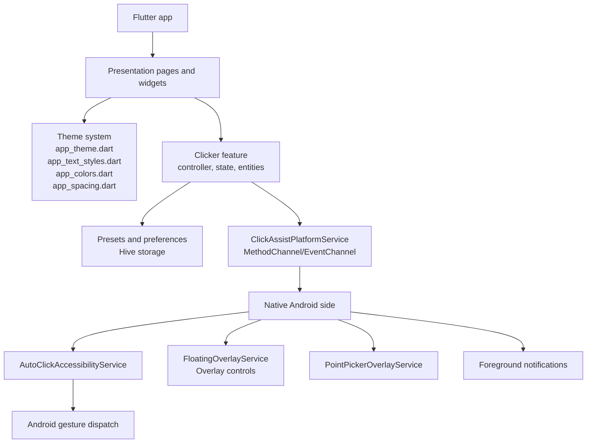
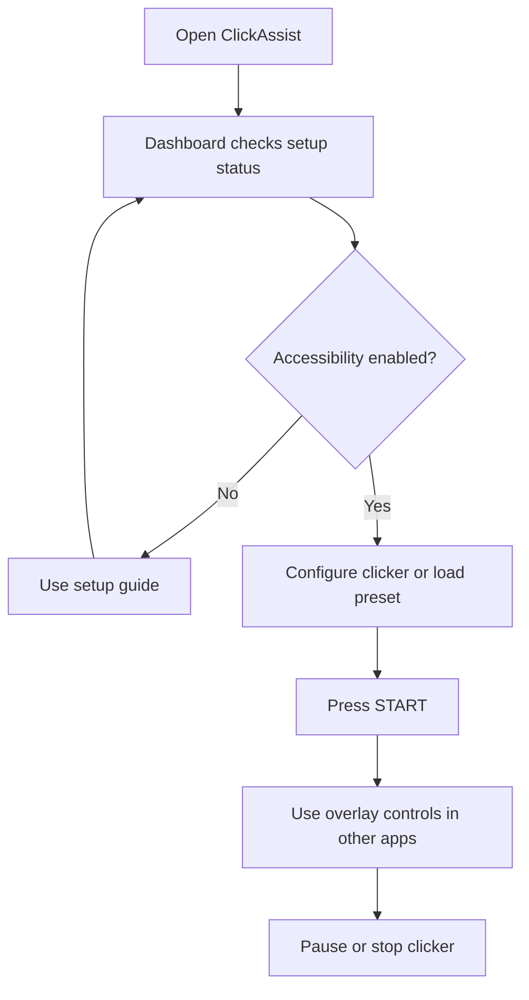
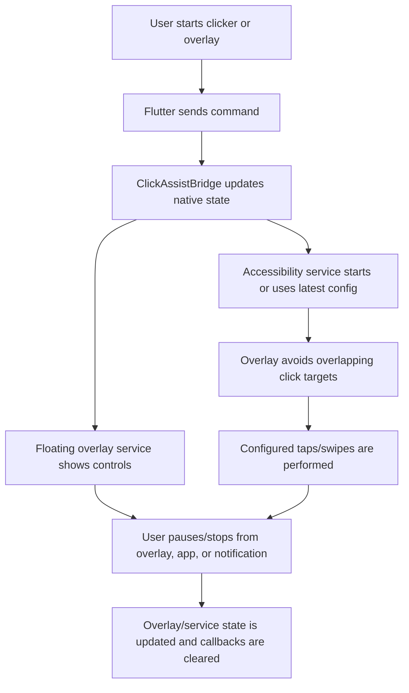
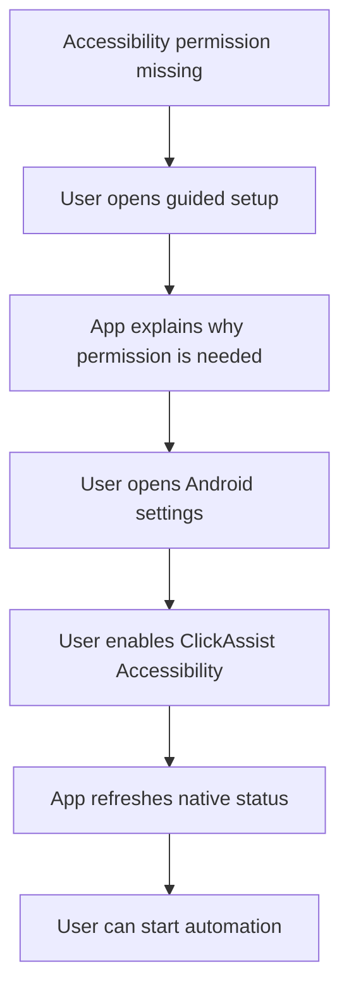
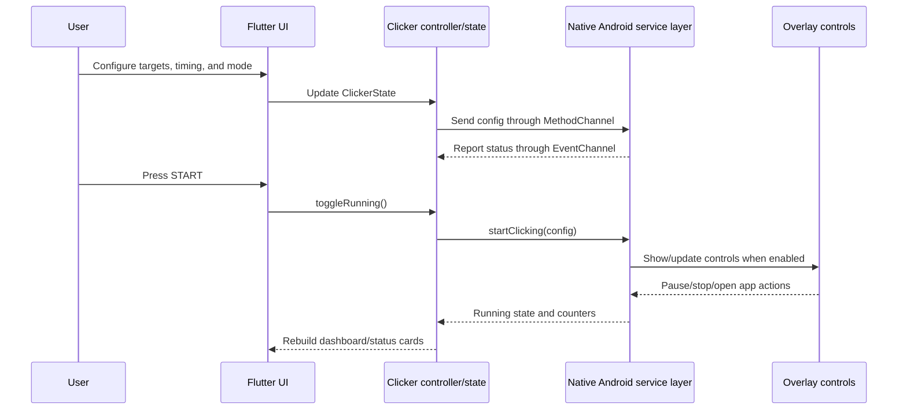

# ClickAssist Project Analysis

## 1. Project Overview

ClickAssist is an open-source Flutter and Kotlin Android app for user-controlled tap and swipe automation. The app lets a user configure tap targets, mimic recorded gestures, choose timing behavior, and start or stop automation from the app, a native overlay, or notification controls.

The project is Android-focused. Flutter owns the user interface, state, validation, local presets, and documentation surfaces. Native Android owns accessibility gesture dispatch, overlay windows, point-picking overlays, foreground notifications, and device status reporting.

ClickAssist is designed around explicit user control. The current codebase does not include accounts, cloud sync, analytics, crash reporting, or remote configuration.

## 2. Current Feature Set

Current features visible in the source include:

- Manual click points captured from the screen with a point picker overlay.
- Mimic pattern recording for tap and swipe sequences.
- Sequential and simultaneous multi-point execution.
- Tap pattern presets: single, double, triple, burst, wave, and heart.
- Speed presets from slow to ultra-fast, plus a custom interval field.
- Optional start delay.
- Infinite mode or count mode with a target cycle count.
- Gesture indicators for tap and swipe feedback.
- Local presets with save, apply, edit, delete, import, and export behavior.
- Floating Android overlay controls for use outside the app.
- Setup guide for Accessibility, overlay permission, notifications, and battery optimization.
- Dashboard status cards for blocking setup, warnings, ready state, and running state.
- Help, safety, privacy, responsible-use, and settings/legal pages.

## 3. Branding and Logo

The current visual identity is a dark navy interface with cyan/blue accents, rounded panels, neon-like borders, and concise status copy.

Current brand assets:

- `../design/logo.svg`
- `../design/logo.png`
- `../design/clickassist-app-icon.svg`
- `../design/clickassist-app-icon.png`
- `../implementation/clickassist/assets/branding/app_icon.png`
- `../implementation/clickassist/assets/branding/logo.png`
- `../implementation/clickassist/assets/branding/logo_transparent.png`
- `../implementation/clickassist/android/app/src/main/res/drawable/clickassist_overlay_logo.png`
- `../implementation/clickassist/android/app/src/main/res/drawable-nodpi/ic_launcher_full.png`

Current logo usage in the app:

- `BrandLogo.full` uses `assets/branding/logo_transparent.png` for full lockup surfaces.
- `BrandLogo.compact` combines `BrandLogo.mark`, app name text, and tagline text.
- `BrandLogo.mark` uses `assets/branding/app_icon.png`.
- The dashboard header uses compact branding.
- Onboarding uses the full lockup.
- Settings and legal app-info content uses the logo mark with Flutter-rendered app name/tagline.
- Empty preset state and branded controls use the logo mark.
- The collapsed native overlay button uses the ClickAssist logo.
- The expanded overlay start/pause button uses play/pause controls, not the logo.
- Android launcher icons use the approved full app icon through density PNGs and the adaptive `ic_launcher_full.png` drawable.

## 4. Screenshots

The previous repository screenshot was moved to `outdated/screenshots/Display.png` because it does not reflect the latest dashboard header branding, setup guide placement, spacing, typography cleanup, or current overlay branding behavior.

TODO: Replace with updated screenshot after running the app on a device/emulator.

Recommended screenshot set after device verification:

- Dashboard at first-run/setup state.
- Dashboard after required permissions are enabled.
- Point picker overlay.
- Floating overlay collapsed and expanded.
- Settings & Legal / App Info card showing current branding.

No new screenshots are included here because no current screenshots were generated during this documentation pass.

## 5. Architecture

Primary Flutter app location: `../implementation/clickassist/lib/`

Primary native Android location: `../implementation/clickassist/android/app/src/main/kotlin/app/clickassist/android/`

Current active Flutter structure:

```text
implementation/clickassist/lib/
├── app/
│   ├── routes/
│   └── theme/
├── core/
│   ├── config/
│   └── services/
├── features/
│   └── clicker/
│       ├── data/
│       ├── domain/
│       └── presentation/
├── widgets/
└── main.dart
```

Important native Android files:

- `AutoClickAccessibilityService.kt` dispatches configured taps and swipes through Android accessibility gestures.
- `ClickAssistBridge.kt` holds native runtime state and coordinates Flutter/native status.
- `FloatingOverlayService.kt` owns the floating overlay controls.
- `PointPickerOverlayService.kt` captures screen coordinates for manual targets.
- `GestureIndicatorOverlay.kt` renders optional tap/swipe feedback.
- `MainActivity.kt` exposes MethodChannel and EventChannel bindings.
- `AppStatusNotifier.kt` owns foreground notification status.

State and communication:

- Flutter uses Riverpod through `ClickerController` and `ClickerState`.
- Flutter sends commands through `ClickAssistPlatformService`.
- Native Android receives commands through `MethodChannel`.
- Native Android reports status through `EventChannel`.
- Presets are stored locally through Hive via `ClickerPresetStorage`.

## 6. UI/UX Direction

ClickAssist currently uses a dense but guided dashboard layout:

- Compact branded header with action buttons for Help & Safety, Settings & Legal, and refresh.
- Statistic panel for APS, current actions, and total actions.
- Dashboard status card that prioritizes blocking setup requirements and warnings.
- Guided setup card near the top of the dashboard.
- Large circular start/stop button with explicit text and icon.
- Collapsible section cards for configuration groups.
- Responsive tiles and wraps for narrow phone surfaces.
- Settings/legal pages with tighter spacing and branded app-info content.

The UX direction is explicit and safety-oriented. Sensitive actions open Android settings only after user-triggered controls or disclosures. The app favors visible status, clear setup steps, and stop controls over hidden automation.

## 7. Theme System

The app-wide dark theme is centralized in `../implementation/clickassist/lib/app/theme/app_theme.dart`.

`AppTheme.darkTheme` wires:

- `TextTheme`
- app bar styles
- filled, outlined, and text button styles
- input decoration
- snack bar styling
- dialog styling
- switch styling
- progress indicator styling
- shared surface, stroke, and interaction behavior

Color tokens live in `app_colors.dart`, spacing and radius tokens live in `app_spacing.dart`, and typography tokens live in `app_text_styles.dart`.

## 8. Typography System

Typography is centralized in `../implementation/clickassist/lib/app/theme/app_text_styles.dart`.

Current typography tokens include:

- `headlineLarge`
- `headlineMedium`
- `titleLarge`
- `titleMedium`
- `bodyLarge`
- `bodyMedium`
- `bodySmall`
- `labelUppercase`
- `statValue`
- `buttonText`
- compact/readable/status variants

`app_theme.dart` maps these tokens into Flutter `TextTheme` and component themes. Recent widget updates reduced ad-hoc typography overrides in favor of these shared tokens.

Important widgets using the centralized typography and theme direction include:

- `clicker_start_button.dart`
- `dashboard_status_card.dart`
- `setup_guide_card.dart`
- `clicker_section_card.dart`
- `settings_action_tile.dart`
- `settings_legal_page.dart`

The test `../implementation/clickassist/test/widgets/typography_consistency_test.dart` guards against hardcoded typography primitives outside the theme files.

## 9. Overlay and Accessibility Flow

ClickAssist uses Android AccessibilityService only to dispatch gestures configured by the user. It does not read screen text, upload data, or start automation without user action based on the current source.

The floating overlay behavior currently includes:

- Requires overlay permission and AccessibilityService readiness.
- Runs through `FloatingOverlayService`.
- Shows a collapsed ClickAssist logo button.
- Expands into a status/control bar with mode, speed, picker status, start/pause, stop, and open-app controls.
- Uses play/pause icons for the expanded start/pause control.
- Stops or hides according to bridge state and user controls.
- Uses a foreground notification while active.
- Tracks its current on-screen bounds and treats the overlay plus a small safe margin as a protected zone.
- Moves away from configured automation targets before dispatching gestures when a target overlaps the protected zone.
- Skips the protected tap/swipe if relocation cannot make the target safe.
- Keeps manual overlay touches enabled so pause, stop, close/open-app controls, and dragging remain available while automation runs.

The point picker overlay is separate. It captures a screen coordinate and exits after the point is captured or cancelled.

## 10. Presets and Clicker Configuration

Clicker configuration is represented by domain entities in `features/clicker/domain/entities/`, including click points, steps, modes, tap patterns, and presets.

Current configuration supports:

- Manual click points.
- Mimic click points and steps.
- Tap and swipe step types.
- Per-step delay and press duration.
- Sequential or simultaneous timing.
- Multi-click enablement.
- Speed preset and custom interval.
- Start delay.
- Infinite or count-based mode.
- Gesture indicator preference.

Presets are local-only. They include the active input mode, timing settings, click mode, visual feedback preference, and source-specific manual/mimic data. Import/export uses JSON through the settings/data actions UI.

## 11. Testing and Quality Guards

Current tests include:

- Theme tests in `test/app/theme/app_theme_test.dart`.
- Controller tests in `test/features/clicker/presentation/providers/clicker_controller_test.dart`.
- Brand logo tests in `test/widgets/brand_logo_test.dart`.
- Branding/native asset consistency tests in `test/widgets/branding_asset_consistency_test.dart`.
- Dashboard status card tests in `test/widgets/dashboard_status_card_test.dart`.
- Permission card tests in `test/widgets/permission_info_card_test.dart`.
- Setup guide tests in `test/widgets/setup_guide_card_test.dart`.
- Settings/legal spacing tests in `test/widgets/settings_legal_page_spacing_test.dart`.
- Typography consistency guard in `test/widgets/typography_consistency_test.dart`.
- Native overlay protection unit tests in `android/app/src/test/kotlin/app/clickassist/android/OverlayProtectionTest.kt`.

Recent quality guards verify:

- Flutter and Android overlay assets match the design app icon.
- Native overlay uses the logo only for the compact button.
- Android launcher icons are generated from the design app icon.
- Adaptive launcher icons use the full logo drawable.
- Native click dispatch asks the floating overlay to avoid configured targets.
- Overlay protected-zone logic detects inside/outside targets, respects the safe margin, relocates to valid screen positions, and prefers a safe user-selected overlay position when possible.
- Settings/legal app-info layout uses bounded branding without overflow.
- Narrow settings action tiles stack actions instead of crowding.

## 12. Current Limitations

Current limitations visible from the codebase and repository state:

- The product is Android-focused; iOS, macOS, web, and desktop scaffold files exist from Flutter but the automation implementation is native Android.
- AccessibilityService and overlay permissions require manual Android settings changes.
- Existing current screenshots have not been regenerated after the latest UI and branding work.
- Overlay behavior should still be manually verified on physical devices and emulators across different launcher/system-overlay combinations, especially when a click target is directly under a large expanded overlay.
- Android launchers can cache app icons; emulator/device reinstall or launcher refresh may be needed after icon changes.
- No cloud sync, account system, analytics, crash reporting, or remote backup exists.
- Store review remains sensitive because the app uses AccessibilityService, overlay windows, notifications, and foreground services.

## 13. Planned Improvements

Planned or recommended future work, based on current project state:

- Capture a fresh screenshot and demo set after running the latest app on a device/emulator.
- Add native/instrumentation coverage for overlay lifecycle behavior where practical.
- Continue device QA for overlay positioning, target avoidance, and stop/pause controls.
- Review old scaffolded feature folders and either document their purpose or remove them in a dedicated cleanup.
- Expand Play Store readiness documentation after final screenshots, privacy copy, and permission disclosure copy are verified against the shipping build.
- Consider a release checklist that verifies launcher icon cache behavior after reinstall.

## 14. Diagrams

### A. High-level architecture diagram



### B. User flow diagram



### C. Overlay lifecycle diagram



### D. Permission/setup flow



### E. Sequence diagram



## 15. Outdated Documentation Archive

Outdated documentation and screenshots are kept in `docs/outdated/` instead of being deleted. This preserves historical context while keeping current documentation accurate.

Archived during the latest documentation cleanup:

- Previous subsystem docs under `docs/outdated/previous-docs/`.
- Previous dashboard screenshot under `docs/outdated/screenshots/Display.png`.
- Previous demo video under `docs/outdated/media/Video.webm`.
